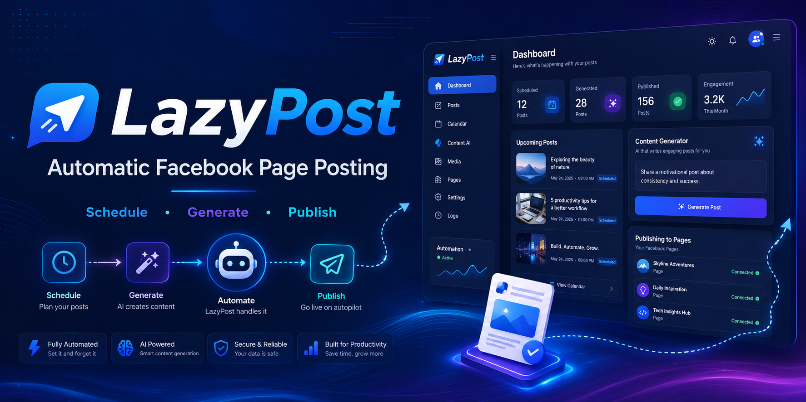

# Lazypost 1.0 Lite



Standalone no-OpenAI Facebook Page auto poster.

Built by **Vincent Ilagan**.

## What It Does

Lazypost 1.0 Lite creates branded Facebook Page posts without using OpenAI credits.

It uses:

- Google Trends RSS for live topics
- Google Trends image URLs for post backgrounds
- browser canvas for local layout rendering
- Facebook Graph API for live Page posting
- smoke testing so you can preview layouts before posting

## Features

- No OpenAI API key required
- Smoke test mode with no Facebook posting
- Live post mode for Facebook Pages
- Auto-post interval slider
- Google Trends topic/image background
- Tagalog, English, and mixed-language captions
- Trend, hugot, and auto-mix content modes
- PNG/JPG/WebP logo upload
- Local browser storage for Page ID, token, and logo

## Requirements

- Windows 10 or Windows 11
- Node.js 18 or newer
- Facebook Page admin access
- Facebook Page access token
- Internet connection for Google Trends images and Facebook posting

## Install

Double-click:

```text
Install Lite Auto Poster.bat
```

The installer checks Node.js and verifies the app files.

## Run

Double-click:

```text
Start Lite Poster.bat
```

Then open:

```text
http://localhost:8790
```

## Smoke Test First

Use `Smoke test only` before going live.

Smoke test mode:

- loads a Google Trends topic
- downloads/proxies the trend image
- generates the branded layout
- writes the caption
- does not use Facebook token
- does not post to Facebook

## Live Posting

To post live:

1. Select `Live post to Facebook`.
2. Enter your Facebook Page ID.
3. Enter your Facebook Page access token.
4. Click `Save Facebook keys`.
5. Choose country, language, and post type.
6. Click `Start Auto Posting`.

If `Keep posting automatically` is checked, it will continue based on the selected interval.

## Facebook Permissions

The Page token should include:

```text
pages_show_list
pages_read_engagement
pages_manage_posts
```

The token must be a Page token, not only a personal user token.

## Notes

- This lite version is separate from the main AI app.
- This version does not use OpenAI.
- This version still uses Facebook Graph API when Live mode is selected.
- Keep the terminal/BAT window open while auto posting.

## Security

- Do not share your Facebook Page token publicly.
- Do not commit real tokens to GitHub.
- Use smoke testing before live posting.
